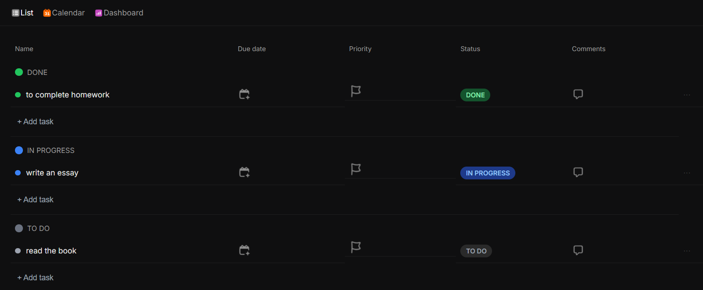
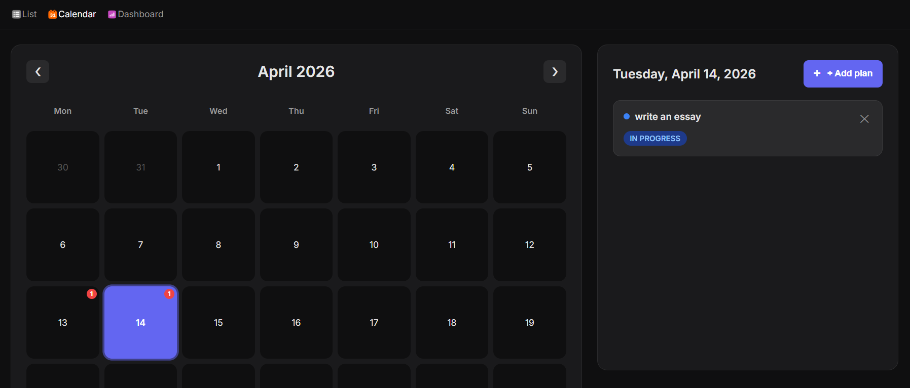
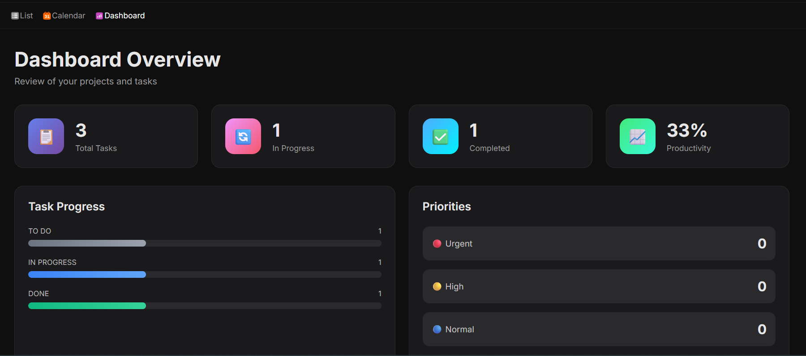
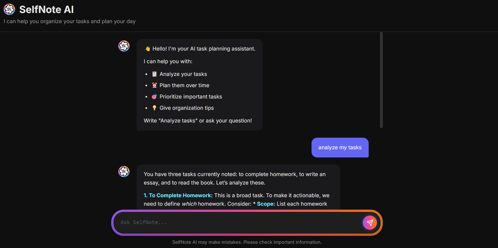

#  SelfNote

> **SelfNote** — is an ultra-convenient note and task manager designed to make your day-to-day interaction with information easier, faster, and more engaging.

---

## 🆕 What's New: v1.3

### 🚀 Key Updates
* **UI/UX Refinement**: updated sidebar for a more engaging experience.

### 🛠 Improvements and Fixes
* **Bug fixes**: troubleshooting translation issues and minor changes.

---

## ✨ Key features

At present, SelfNote can:

* 🗂️ **Universal Organizer**: Keep all your thoughts, ideas, and structured notes in one accessible place.

* ✅ **Task Management**: Seamlessly create and track your daily tasks. Organize your workflow with categories like "To Do", "In Progress", and "Done".

* 📅 **Visual Planning**: Stay ahead of your schedule with the integrated calendar view. Track deadlines and plan your month at a glance.

* 📊 **Analytics Dashboard**: Get a high-level overview of your productivity. Track task progress, priorities, and overall efficiency in real-time.

* 🤖 **Integrated AI Chat**: A built-in intelligent assistant that helps you brainstorm, summarize notes, or answer questions on the fly.

* 🎨 **Premium UI/UX**: Designed with a focus on modern aesthetics, utilizing a dark theme and clean layouts for a superior user experience.

* ⚡ **High Performance**: Optimized for speed to ensure your workflow remains uninterrupted.

---

## 🛠 Project status

| Parameter | Value |
| :--- | :--- |
| **Version** | v1.3 |
| **Access** | Free |
| **Stage** | Active Development 🚧 |

> [!IMPORTANT]
> The AI integration and task synchronization modules are currently under active development. We are constantly refining the logic to ensure the best performance and data reliability.

---

## 🚀 Plans for the future (Roadmap)

- [ ] Implementation of global cloud synchronization
- [ ] Advanced AI features for automated task categorization
- [ ] Mobile-responsive version for on-the-go note-taking
- [ ] Customizable themes and workspace layouts

---

## 🤝 Feedback

Your feedback is incredibly important for the evolution of SelfNote! If you have any ideas, suggestions, or have found a bug, please feel free to create an issue or reach out through our community channels.

## 🔗 Links

*  [Website](https://selfnote-prod.vercel.app) — link to the latest version
*  [Telegram Channel](https://t.me/selfnoteai) — stay updated and suggest new features
